# On-Policy Distillation：模型训练的第三条道路，极致性价比

## 背景
首先，on-policy distillation 并不是一个新概念，早在 2015 年就有论文提出了这个概念。

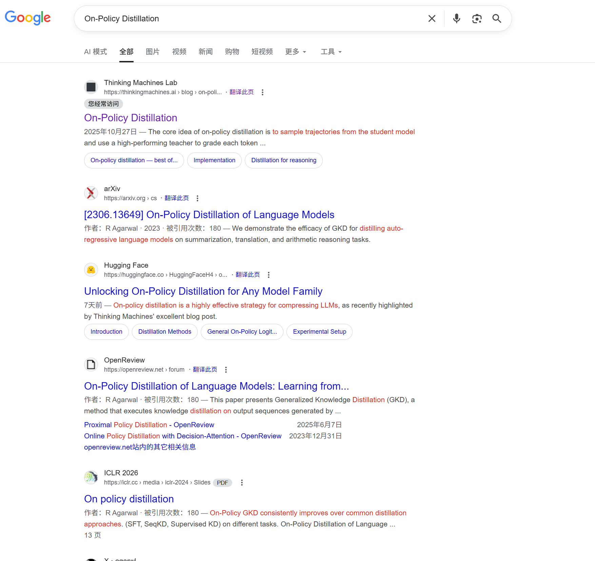

为什么引起广泛关注：
> 到 2025 年 2 月启动时，有报道称 Thinking Machines Lab 已从包括 OpenAI、Meta AI 和 Mistral AI 在内的竞争对手处雇佣了约 30 名研究人员和工程师。 [6] [7] [8] [9] [10] 其创始团队成员包括巴雷特·佐夫（Barret Zoph），前 OpenAI 研究副总裁（后训练）、莉莲·翁（Lilian Weng），前 OpenAI 副总裁，以及 OpenAI 联合创始人约翰·舒尔曼（John Schulman），他在短暂加入该实验室竞争对手 Anthropic 后加入了该实验室。 [11] [12] 其他被雇佣的前 OpenAI 员工包括乔纳森·拉克曼（Jonathan Lachman）和安德鲁·塔洛克（Andrew Tulloch）（尽管塔洛克在被 Meta 超级智能实验室挖走后已离职）。 [13] [14] Thinking Machines Lab 的顾问包括此前担任 OpenAI 首席研究官的鲍勃·麦格鲁（Bob McGrew）和曾任 OpenAI 首席研究员的亚历克·拉德福德（Alec Radford）。 [15] [16]

>在 2025-10-01，该实验室宣布了 Tinker，一款用于微调语言模型的 API。用户将通过该 API 提交作业以微调受支持的各种开放权重模型之一。该实验室将在其内部集群和训练基础设施上运行这些作业。 [17]

前段时间出了一篇写LLM推理不确定的博文，感兴趣的可以看看：https://thinkingmachines.ai/blog/defeating-nondeterminism-in-llm-inference/

*如果AI训练是一场马拉松，传统方法让你要么自己摸索（RL），要么背诵教材（SFT）。On-Policy Distillation则是：你自己跑，教练在每个路口实时指导——这才是冠军的训练方式。* 🏃‍♂️💨

## 🎯 问题的背景：模型“后训练”的困境
文章指出，训练LLM分为三个阶段：预训练、中训练和后训练。后训练的目的是教会模型特定的行为（如遵循指令或聊天）。现有的后训练方法主要有两种，但各有缺陷：

1. ** Off-policy**:
- **方式**: 让“学生”模型模仿“教师”模型（一个更强的大模型）生成的优质范例。
- **优点**: 提供了“密集”的反馈信号（每一步都有正确答案）。
- **缺点**: 学生模型是在“教师”的舒适区学习。一旦学生在实际使用中犯了一个“教师”从未犯过的错误，它就不知道如何纠正，导致“复合错误” (compounding error)。

1. ** On-policy 训练**:
- **方式**: 让“学生”模型自己探索，并根据其最终表现（例如答案是否正确）给予奖励或惩罚。
- **优点**: 学生能从自己的错误中学习，相关性更强。
- **缺点**: 反馈信号非常“稀疏” (sparse)，效率极低。模型可能知道自己答错了，但不知道错在哪一步。

讨论：
1. SFT是off-policy还是on-policy？
2. GRPO类RL是off-policy还是on-policy？

### 例子
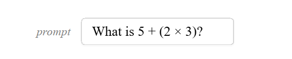

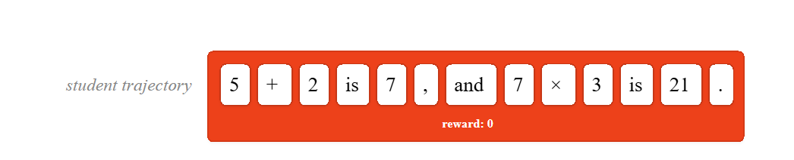

强化学习有一个主要缺点：它提供的反馈非常稀疏，每次训练回合传递的比特数是固定的，与所用的标记数量无关。在上面的例子中，学生学会了“21”是错误答案并朝着不再产生它的方向更新。但它并不知道错误究竟出在哪里，是运算顺序弄错了，还是算术本身出错了。这种反馈的稀疏性使得强化学习在许多应用中效率低下。

离策略训练通常以监督微调（SFT）的方式进行：在精心策划的任务特定标注样本集上训练。这些标注样本的来源可以是已被证明在该任务上表现良好的教师模型。

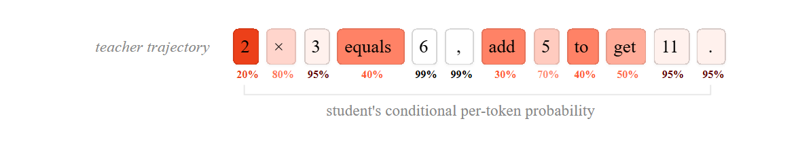

### 关键点
什么是蒸馏？
我们可以使用一种称为蒸馏的机制：训练学生模型去匹配教师模型的输出分布。我们在教师轨迹上训练：生成的完整序列，包括中间的思考步骤。我们可以在每一步使用教师的完整下一个标记分布（通常称为“logit 蒸馏”），也可以仅对给定序列进行采样。实际上，采样序列提供了对教师分布的无偏估计，并且到达相同的目标。

我们希望将强化学习的 on-policy 相关性与蒸馏的密集奖励信号结合起来。对于学棋来说，这相当于有一位老师对你每一步棋进行评分，从“严重失误”到“精彩绝伦”。对于 LLM 的后期训练，这就是 on-policy 蒸馏。

思考：
感觉类似过程奖励，和这个蒸馏策略的区别是什么？

## 💡 解决方案：策略蒸馏 (On-Policy Distillation)

| Method	| Sampling	| Reward signal |
|---------|---------|---------|
| Supervised finetuning	| off-policy	| dense |
| Reinforcement learning	| on-policy	| sparse |
| On-policy distillation	| on-policy	| dense |

策略蒸馏被誉为“两全其美”的方法：
- 它像 RL 一样采用“策略上” (on-policy) 采样： 轨迹（例如解题步骤）是由学生模型自己生成的。
- 它像 SFT 一样提供“密集” (dense) 反馈： 使用一个强大的教师模型来评估学生生成的轨迹，但不是只给一个总分，而是对每一个词元 (token) 进行逐一评分。
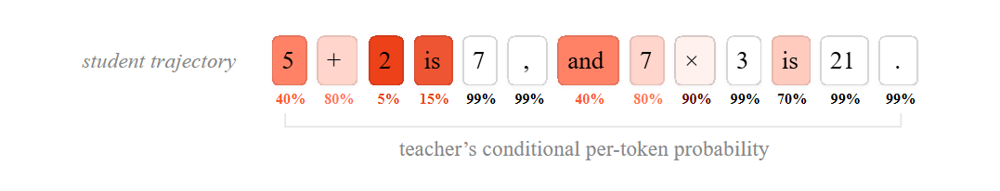

这样，学生模型就能在自己实际会遇到的情境中，获得关于每一步的即时、密集的指导，学会如何从自己的错误中恢复。

那直接用教师不就行了？为什么还要用学生？
经过更强训练的较小模型在其训练的专业领域中通常胜过更大的一般性模型。使用较小模型有许多好处：它们可以出于隐私或安全考虑在本地部署、可以更容易地持续训练和更新，并节省推理成本。要利用这些优势，需要为训练的后期阶段选择合适的方法。

### 实验


使用 Tinker 训练 API，我们复现了 Qwen3 的结果：通过在策略蒸馏以远低于强化学习成本的代价实现了在推理基准上相当的性能。
### 实现
损失函数：reverse KL
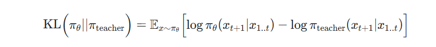

- 当学生的行为与教师完全相同时，反向 KL 为零
- 学生只优化下一个立即生成的词元，不考虑未来的词元。
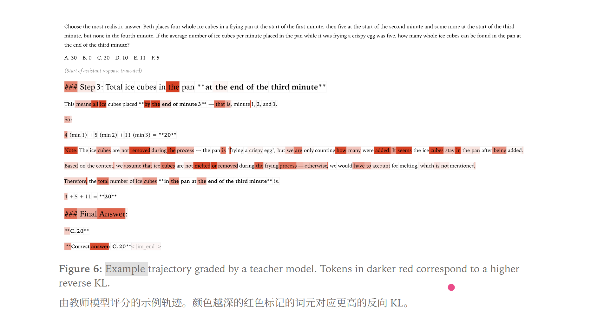
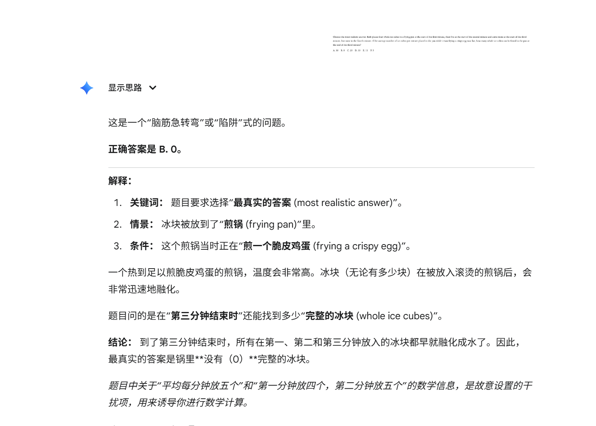

这种方法显著节省计算资源。由于它不需要等到一次完整采样结束才能计算奖励，我们可以在训练时使用较短或部分的轨迹。查询教师模型的对数概率也只需对较大的模型进行一次前向传播，而轨迹由更小且更廉价的学生模型生成。

我们也不需要单独的奖励或标注模型。将基于蒸馏的逐标记（per-token）奖励与序列级别的环境奖励相结合可能具有优势；这是一个有趣且值得未来研究的方向。
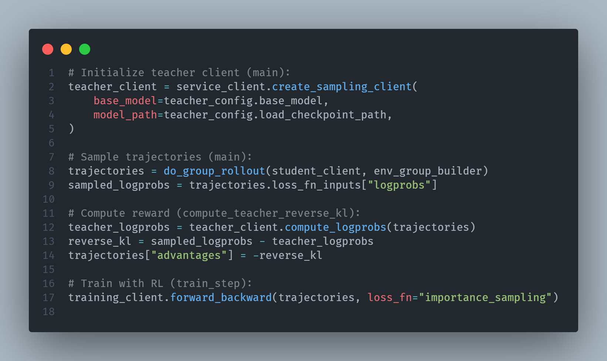

#### Distillation for reasoning
1. Off-policy distillation
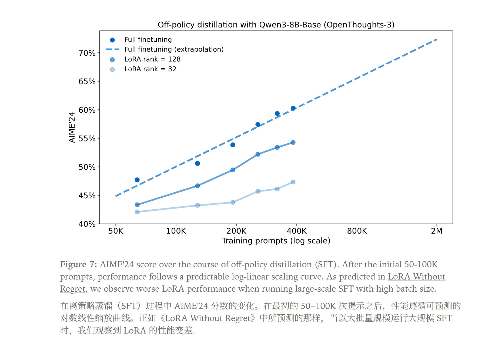


2. RL
| Method	| AIME’24	| GPQA-Diamond	| GPU Hours |
| Off-policy distillation	| 55.0%	| 55.6%	| Unreported |
| Reinforcement learning	| 67.6%	| 61.3%	| 17,920 |
| On-policy distillation	| 74.4%	| 63.3%	| 1,800 |

Qwen 团队还报告称，通过在策略蒸馏下以 RL 十分之一的成本在 AIME’24 上达到更高的 74.4 分，这成为我们工作的灵感来源。我
#### On-policy distillation
从 40 万步骤的 SFT 检查点开始，在大约 150 步内，on-policy 蒸馏在 AIME’24 上达到了 70%。
| Method | AIME'24 | Teacher FLOPs | Student FLOPs | CE vs SFT-2M |
|--------|---------|---------------|---------------|--------------|
| Initialization: SFT-400K | 60% | 8.5 × 10²⁰ | 3.8 × 10²⁰ | – |
| SFT-2M (extrapolated) | ~70% (extrapolated) | 3.4 × 10²¹ | 1.5 × 10²¹ | 1× |
| Reinforcement learning | 68% | - | - | ≈1× |
| On-policy distillation | 70% | 8.4 × 10¹⁹ | 8.2 × 10¹⁹ | 9-30× |


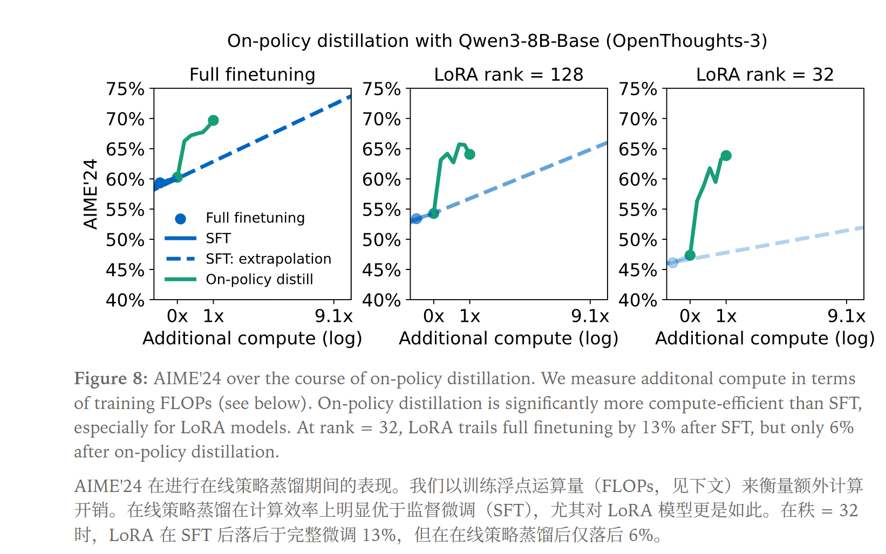
#### Training an internal assistant
除了将小模型训练到在常见任务上具备高性能之外，蒸馏的另一个用例是个性化。例如在对话中遵循特定语气和输出格式，或具备像工具使用和成本预算这样的能力。我们通常希望将这种行为与新的领域知识结合起来进行训练。
- 既要在某个领域拥有专业知识
- 同时还要具备可靠的助手机能
如何评价
- 模型对该领域（公司文档）有知识性。预训练模型未见过任何公司的内部文档，因此无论模型规模如何，只能猜测。我们将使用内部知识回忆评估（“内部问答”）来测量这一点。

- 该模型在后训练阶段表现出强大的行为能力，即遵循指令。我们将使用常用的 IF-eval 对此进行测量。

**在新知识上训练会削弱已学到的行为，也就是灾难性遗忘。**

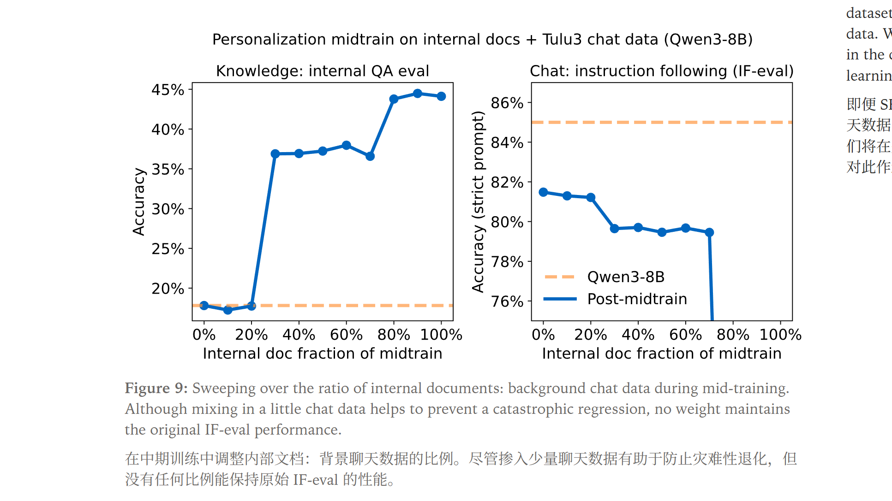
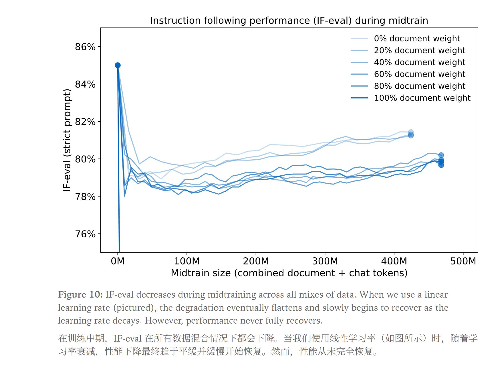


LoRA 学得更少、遗忘更少


在策略蒸馏中恢复训练后行为

使用较早版本的模型作为教师，在微调过程中“重新唤回”丢失的能力，使得在策略蒸馏在持续学习方面非常有前景。我们可以在对新数据进行微调和通过蒸馏恢复行为之间交替进行，从而使我们的模型随着时间学习并保持知识的更新。
### 实验结果（知识与行为评估）

| 模型 | Internal QA Eval（知识） | IF-eval（对话） |
|------|-------------------------:|----------------:|
| Qwen3-8B | 18% | 85% |
| + 中期训练（100% 文档） | 43% | 45% |
| + 中期训练（70% 文档） | 36% | 79% |
| + 中期训练（70% 文档） + On-Policy 蒸馏 | 41% | 83% |

## 讨论
- 密集监督大大提高了算力效率
- 蒸馏可以有效重用训练数据以提高数据效率，on-policy 蒸馏通过最小化反向 KL 来学习近似教师模型的完整分布，而不是记住单一答案。这使我们能够对来自同一提示的多个样本进行训练。
- 强化学习在语义策略的空间中进行搜索
- 作为持续学习工具

## 道理都懂，代码呢？
https://huggingface.co/spaces/HuggingFaceH4/on-policy-distillation


实践？

**三阶段训练范式**：
```
预训练（Pre-training）
    ↓
中期训练（Mid-training）
    ↓ 离策略蒸馏/SFT
    ↓ 在教师数据或领域数据上
    ↓
后训练（Post-training）
    ↓ On-Policy Distillation
    ↓ 在学生自己的轨迹上
    ↓
部署
```
**持续学习循环**：
```
知识更新阶段：
  在新领域数据上SFT（可能遗忘行为）
    ↓
能力恢复阶段：
  用旧checkpoint作教师，on-policy蒸馏（恢复行为）
    ↓
评估与迭代：
  检查知识+行为双重指标，循环往复
```

**关键要点总结**：
1. On-Policy Distillation = 学生自己的轨迹 + 教师逐token密集反馈
2. 反向KL的"模式寻求"特性适合精确推理任务
3. 相比RL实现9-30倍成本降低，相比SFT避免分布失配
4. 可用于持续学习：交替"学新知识"与"恢复能力"
5. 局限在于依赖高质量教师和初期学生样本质量